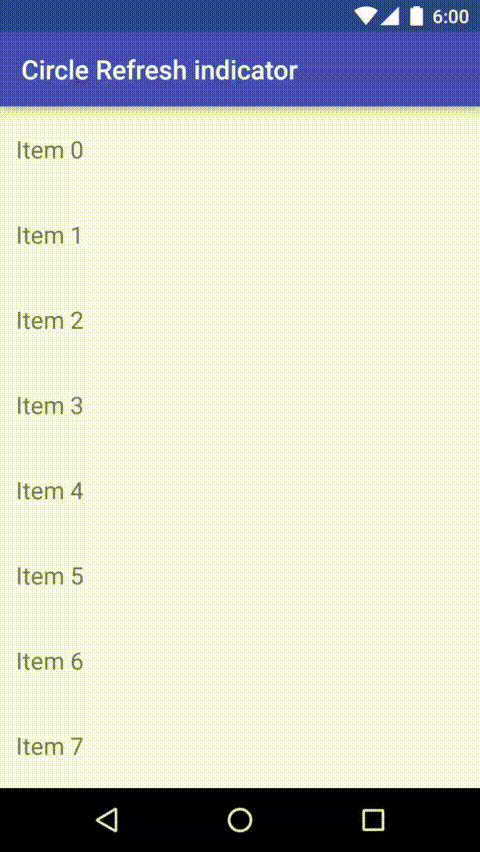
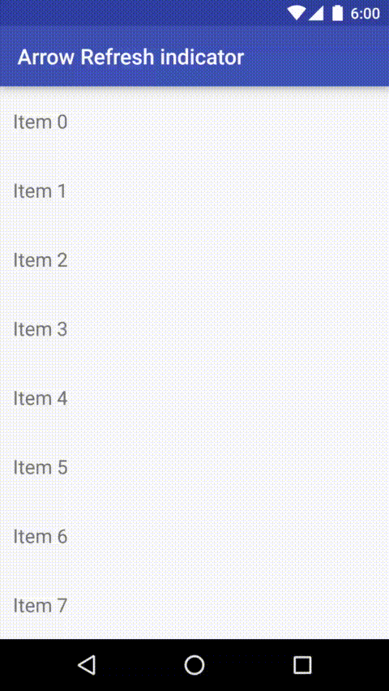
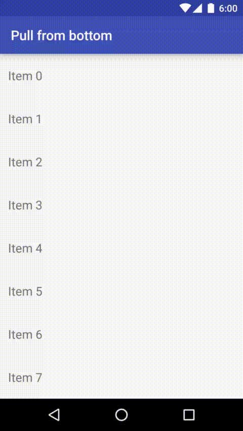

# android-CircleRefreshLayout 

A customized SwipeRefreshLayout that supports circular refresh indicator and pull-down to refresh.

## Screenshots

### Circle Refresh indicator (No arrow)


### Arrow Refresh indicator (Same as original SwipeRefreshLayout)


### Pull from bottom


## Usage

### Change Refresh drawable style

```java
SwipeRefreshLayout layout = (SwipeRefreshLayout) findViewById(/* Resource id */);

// Circle (which is default)
layout.setRefreshDrawableStyle(SwipeRefreshLayout.CIRCLE);

// Or with arrow (which is default in original SwipeRefreshLayout in Support Library)
layout.setRefreshDrawableStyle(SwipeRefreshLayout.ARROW);
```

### Change Pull position

```java
SwipeRefreshLayout layout = (SwipeRefreshLayout) findViewById(/* Resource id */);

// Pull from bottom
layout.setPullPosition(Gravity.BOTTOM);

// Or from top, which is default
layout.setPullPosition(Gravity.TOP);
```

## Download

Core:
```groovy
compile 'com.androidhuman.circlerefreshlayout:circlerefreshlayout:0.1.0'
```

RxBinding support:
```groovy
compile 'com.androidhuman.circlerefreshlayout:circlerefreshlayout-rxbinding:0.1.0'
```

## License

```
Copyright 2016 Taeho Kim <jyte82@gmail.com>

Licensed under the Apache License, Version 2.0 (the "License");
you may not use this file except in compliance with the License.
You may obtain a copy of the License at

   http://www.apache.org/licenses/LICENSE-2.0

Unless required by applicable law or agreed to in writing, software
distributed under the License is distributed on an "AS IS" BASIS,
WITHOUT WARRANTIES OR CONDITIONS OF ANY KIND, either express or implied.
See the License for the specific language governing permissions and
limitations under the License.
```
